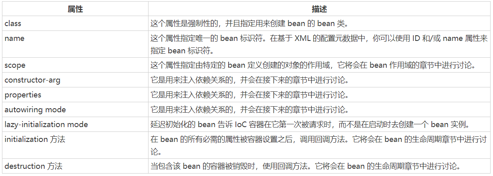
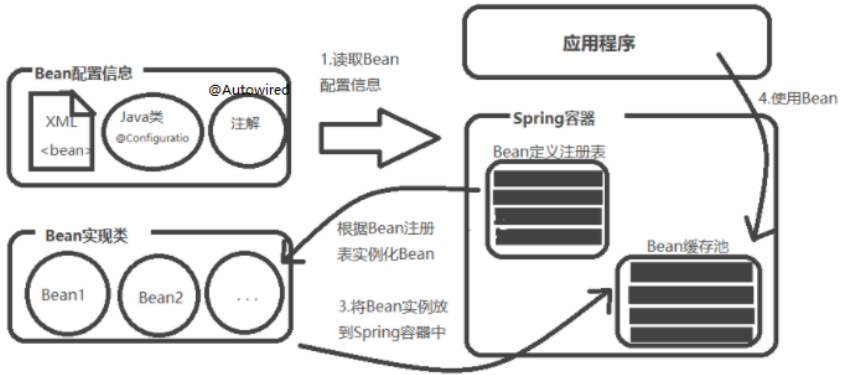
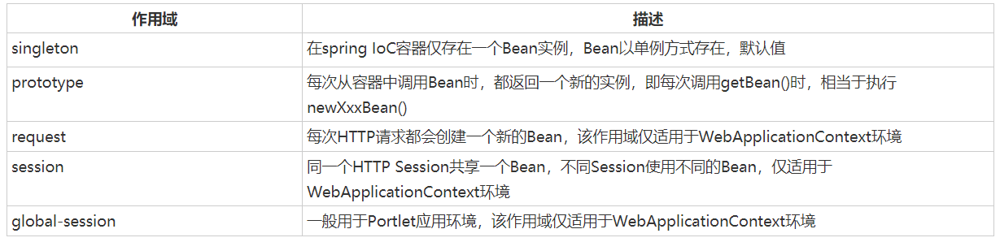

# Spring Bean定义
被称作 bean 的对象是构成应用程序的支柱也是由 Spring IoC 容器管理的。bean 是一个被实例化，组装，并通过 Spring IoC 容器所管理的对象。**在Java中一个类每个属性都具有set和get方法，就认为这个Java对象是个Bean**。这些 bean 是由用容器提供的配置元数据创建的。其中Spring支持三种格式的配置元数据:
1. 基于Java
2. 基于注解（annotation）
3. 基于XML
   
bean 定义包含称为**配置元数据**的信息，容器也需要知道配置元数据：
1. 如何创建一个 bean
2. bean 的生命周期的详细信息
3. bean 的依赖关系

上述所有的配置元数据转换成一组构成每个 bean 定义的下列属性。


## Bean与Spring容器的关系
下图表达了Bean 与 Spring 容器之间的关系：


## Spring配置元数据
Spring IoC 容器完全由实际编写的配置元数据的格式解耦。有下面三个重要的方法把配置元数据提供给 Spring 容器：
1. 基于 XML 的配置文件
2. 基于注解的配置
3. 基于 Java 的配置
提示：对于基于 XML 的配置，Spring 2.0 以后使用 Schema 的格式，使得不同类型的配置拥有了自己的命名空间，是配置文件更具扩展性。
你已经看到了如何把基于 XML 的配置元数据提供给容器，但是让我们看看另一个基于 XML 配置文件的例子，这个配置文件中有不同的 bean 定义，包括延迟初始化，初始化方法和销毁方法的：
```xml
<?xml version="1.0" encoding="UTF-8"?>

<beans xmlns="http://www.springframework.org/schema/beans"
    xmlns:xsi="http://www.w3.org/2001/XMLSchema-instance"
    xsi:schemaLocation="http://www.springframework.org/schema/beans
    http://www.springframework.org/schema/beans/spring-beans-3.0.xsd">

   <!-- A simple bean definition -->
   <bean id="..." class="...">
       <!-- collaborators and configuration for this bean go here -->
   </bean>

   <!-- A bean definition with lazy init set on -->
   <bean id="..." class="..." lazy-init="true">
       <!-- collaborators and configuration for this bean go here -->
   </bean>

   <!-- A bean definition with initialization method -->
   <bean id="..." class="..." init-method="...">
       <!-- collaborators and configuration for this bean go here -->
   </bean>

   <!-- A bean definition with destruction method -->
   <bean id="..." class="..." destroy-method="...">
       <!-- collaborators and configuration for this bean go here -->
   </bean>

   <!-- more bean definitions go here -->

</beans>
```

## Spring Bean作用域
当在 Spring 中定义一个 bean 时，你必须声明该 bean 的作用域的选项。例如，为了强制 Spring 在每次需要时都产生一个新的 bean 实例，你应该声明 bean 的作用域的属性为**prototype**。同理，如果你想让 Spring 在每次需要时都返回同一个bean实例，你应该声明 bean 的作用域的属性为**singleton**。
Spring 框架支持以下五个作用域，分别为 singleton、prototype、request、session 和 global session，5种作用域说明如下所示，
注意，如果你使用 web-aware ApplicationContext 时，其中三个是可用的。    


### singleton作用域
singleton 是默认的作用域，也就是说，当定义 Bean 时，如果没有指定作用域配置项，则 Bean 的作用域被默认为 singleton。
当一个bean的作用域为 Singleton，那么 Spring IoC 容器中只会存在一个共享的 bean 实例，并且所有对 bean 的请求，只要 id 与该 bean 定义相匹配，则只会返回 bean 的同一实例。
也就是说，当将一个 bean 定义设置为 singleton 作用域的时候，Spring IoC 容器只会创建该 bean 定义的唯一实例。
**Singleton 是单例类型，就是在创建起容器时就同时自动创建了一个 bean 的对象，不管你是否使用，他都存在了，每次获取到的对象都是同一个对象。注意，Singleton 作用域是 Spring 中的缺省作用域**。你可以在 bean 的配置文件中设置作用域的属性为 singleton，如下所示：
```xml
<!-- A bean definition with singleton scope -->
<bean id="..." class="..." scope="singleton">
    <!-- collaborators and configuration for this bean go here -->
</bean>
```

### prototype 作用域

当一个 bean 的作用域为 Prototype，表示一个 bean 定义对应多个对象实例。Prototype 作用域的 bean 会导致在每次对该 bean 请求（将其注入到另一个 bean 中，或者以程序的方式调用容器的 getBean() 方法）时都会创建一个新的 bean 实例。**Prototype 是原型类型，它在我们创建容器的时候并没有实例化，而是当我们获取bean的时候才会去创建一个对象，而且我们每次获取到的对象都不是同一个对象。** 根据经验，对有状态的 bean 应该使用 prototype 作用域，而对无状态的bean则应该使用 singleton 作用域。
为了定义 prototype 作用域，你可以在 bean 的配置文件中设置作用域的属性为 prototype，如下所示：
```xml
<!-- A bean definition with singleton scope -->
<bean id="..." class="..." scope="prototype">
   <!-- collaborators and configuration for this bean go here -->
</bean>
```

## Spring Bean生命周期
理解 Spring bean 的生命周期很容易。当一个 bean 被实例化时，它可能需要执行一些初始化使它转换成可用状态。同样，当 bean 不再需要，并且从容器中移除时，可能需要做一些清除工作。
尽管还有一些在 Bean 实例化和销毁之间发生的活动，但是本章将只讨论两个重要的生命周期回调方法，它们在 bean 的初始化和销毁的时候是必需的。
为了定义安装和拆卸一个 bean，我们只要声明带有 init-method 和/或 destroy-method 参数的 。init-method 属性指定一个方法，在实例化 bean 时，立即调用该方法。同样，destroy-method 指定一个方法，只有从容器中移除 bean 之后，才能调用该方法。
Bean的生命周期可以表达为：Bean的定义——Bean的初始化——Bean的使用——Bean的销毁

### 初始化回调
org.springframework.beans.factory.InitializingBean 接口指定一个单一的方法：
```java
void afterPropertiesSet() throws Exception;
```
因此，你可以简单地实现上述接口和初始化工作可以在 afterPropertiesSet() 方法中执行，如下所示：
```java
public class ExampleBean implements InitializingBean {
   public void afterPropertiesSet() {
      // do some initialization work
   }
}
```
在基于 XML 的配置元数据的情况下，你可以使用 init-method 属性来指定带有 void 无参数方法的名称。例如：
```xml
<bean id="exampleBean" 
         class="examples.ExampleBean" init-method="init"/>
```
下面是类的定义：
```java
public class ExampleBean {
   public void init() {
      // do some initialization work
   }
}
```
### 销毁回调
org.springframework.beans.factory.DisposableBean 接口指定一个单一的方法：
```java
void destroy() throws Exception;
```
因此，你可以简单地实现上述接口并且结束工作可以在 destroy() 方法中执行，如下所示：
```java
public class ExampleBean implements DisposableBean {
   public void destroy() {
      // do some destruction work
   }
}
```
在基于 XML 的配置元数据的情况下，你可以使用**destroy-method**属性来指定带有 void 无参数方法的名称。例如：
```xml
<bean id="exampleBean"
     class="examples.ExampleBean"destroy-method="destroy"/>
```
下面是类的定义：
```java
public class ExampleBean {
   public void destroy() {
      // do some destruction work
   }
}
```
如果你在非 web 应用程序环境中使用 Spring 的 IoC 容器；例如在丰富的客户端桌面环境中；那么在 JVM 中你要注册关闭 hook。这样做可以确保正常关闭，为了让所有的资源都被释放，可以在单个 beans 上调用 destroy 方法。
建议你不要使用 InitializingBean 或者 DisposableBean 的回调方法，因为 XML 配置在命名方法上提供了极大的灵活性。

### 默认的初始化和销毁方法
如果你有太多具有相同名称的初始化或者销毁方法的 Bean，那么你不需要在每一个 bean 上声明初始化方法和销毁方法。框架使用 元素中的 default-init-method 和 default-destroy-method 属性提供了灵活地配置这种情况，如下所示：
```xml
<beans xmlns="http://www.springframework.org/schema/beans"
    xmlns:xsi="http://www.w3.org/2001/XMLSchema-instance"
    xsi:schemaLocation="http://www.springframework.org/schema/beans
    http://www.springframework.org/schema/beans/spring-beans-3.0.xsd"
    default-init-method="init" 
    default-destroy-method="destroy">

   <bean id="..." class="...">
       <!-- collaborators and configuration for this bean go here -->
   </bean>

</beans>
```

## Spring Bean 后置处理器
Bean 后置处理器允许在调用初始化方法前后对 Bean 进行额外的处理。
`BeanPostProcessor`​接口定义回调方法，你可以实现该方法来提供自己的实例化逻辑，依赖解析逻辑等。你也可以在 `​Spring`​ 容器通过插入一个或多个 `​BeanPostProcessor`​ 的实现来完成实例化，配置和初始化一个`​bean`​之后实现一些自定义逻辑回调方法。
你可以配置多个 ​`BeanPostProcessor` ​接口，通过设置 ​`BeanPostProcessor` ​实现的​ `Ordered` ​接口提供的​ `order`​ 属性来控制这些​ `BeanPostProcessor`​ 接口的执行顺序。
`BeanPostProcessor`​ 可以对​ `bean`​（或对象）实例进行操作，这意味着 `​Spring IoC`​ 容器实例化一个 `​bean`​ 实例，然后 ​`BeanPostProcessor`​ 接口进行它们的工作。

注意:
`ApplicationContext`​ 会自动检测由 `​BeanPostProcessor​` 接口的实现定义的 `​bean`​，注册这些​ `bean`​ 为后置处理器，然后通过在容器中创建​ `bean`​，在适当的时候调用它。
在你自定义的的​ `BeanPostProcessor`​ 接口实现类中，要实现以下的两个抽象方法  ​`BeanPostProcessor.postProcessBeforeInitialization(Object, String)`​ 和`  ​BeanPostProcessor.postProcessAfterInitialization(Object, String)​`,注意命名要准确,否则会出现： `“ The type InitHelloWorld must implement the inherited abstract method BeanPostProcessor.postProcessBeforeInitialization(Object, String) ”`​之类的错误。

## Spring Bean定义继承
bean 定义可以包含很多的配置信息，包括构造函数的参数，属性值，容器的具体信息例如初始化方法，静态工厂方法名，等等。
子 bean 的定义继承父定义的配置数据。子定义可以根据需要重写一些值，或者添加其他值。
Spring Bean 定义的继承与 Java 类的继承无关，但是继承的概念是一样的。你可以定义一个父 bean 的定义作为模板和其他子 bean 就可以从父 bean 中继承所需的配置。
当你使用基于 XML 的配置元数据时，通过使用父属性，指定父 bean 作为该属性的值来表明子 bean 的定义。