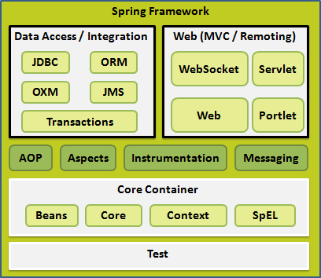
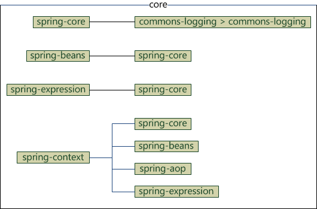

Spring框架提供了20个模块,并且我们在使用的时候只需要引入相关的模块即可,不需要将所有的模块引入。

# 核心容器
核心容器由`spring-core`，`spring-beans`，`spring-context`，`spring-context-support`和`spring-expression`（SpEL，Spring 表达式语言，Spring Expression Language）等模块组成，它们的细节如下：
1. `spring-core`模块提供了框架的基本组成部分，包括 IoC 和依赖注入功能。
2. `spring-beans`
3. `context`
4. `spring-expression`
完整依赖关系：

# 数据访问/集成
数据访问/集成层包括 JDBC，ORM，OXM，JMS 和事务处理模块，它们的细节如下：
(**注：JDBC=Java Data Base Connectivity，ORM=Object Relational Mapping，OXM=Object XML Mapping，JMS=Java Message Service**)

# Web

# 其他